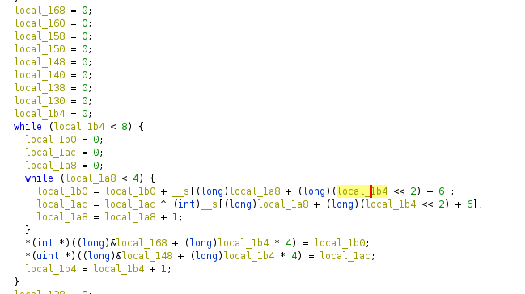

# CTF Writeup: TWCTF2019 easy_crack_me with Z3, Ghidra and pwn

The challenge is a small reverse engineering problem.
The program will print 'Correct' when the right flag is passed to it
as the 1st argument.

Loading the binary in Ghidra, and inspecting the decompilation window, the
structure of it can be roughly subdivided in 5 parts.

1. Checking the size of the argument and if the flag starts with **TWCTF{**

2. Two nested loops doing some basic operations (addition, xor, shifts) followed by 4 memcmp with fixed memory address arrays 

  - the second nested loop,

3. A single loop assigning constants followed by a memcmp with a fixed memory address array

4. A loop doing a reduction of fixed locations of the input and checking against a constant

5. A series of checks against fixed locations of the input

From the above we can develop our exploit script as follows,

1. Use pwn to read the fixed memory addresses to compare against

2. Develop our Z3 model based on the expected size of the flag

3. Transcribe the loops from Ghidra and add the constraints to our Z3 model

4. For all possible satisfiable answers, run the executable with our current flag attempt

For simplicity, we're going to create a bit vector using 4 bytes for each of the possible characters of the flag.
This is done in line 29.
Lines 32-68 simply use the code decompiled by Ghidra to run the same operations as the binary and set up the constraints
that mimic the memcmp calls, the reduction and the if statements.

With our model built and after checking it's satisfiable we loop until a solution is found.

The most interesting part in this section is line 87 which ensures our previous candidate attempt is no longer tried.

The solution is printed after a few secs of running the script.
